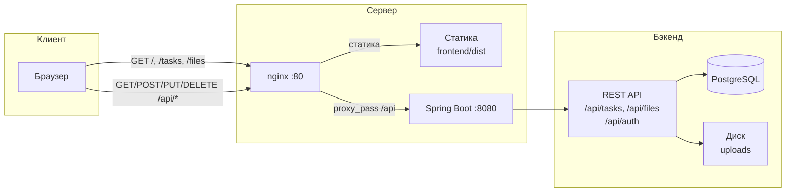
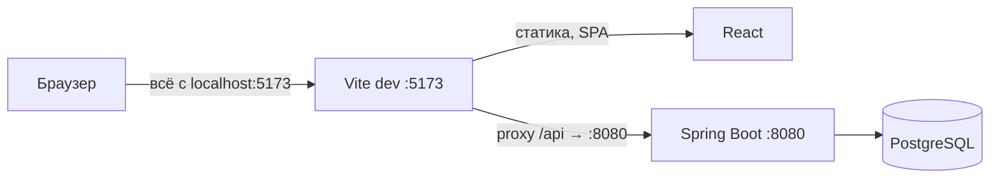

# Cursospring — задачи и файловый менеджер

Веб-приложение: управление задачами и загрузка файлов. Бэкенд — Spring Boot, фронтенд — React. Авторизация через Spring Security (логин/пароль, сессия).

---

## Технологии

### Backend
| Технология | Назначение |
|------------|------------|
| **Java 21** | Язык |
| **Spring Boot 4.x** | Каркас приложения |
| **Spring Web MVC** | REST API |
| **Spring Data JPA** | Работа с БД |
| **Spring Security** | Авторизация (сессия, in-memory пользователь) |
| **Spring Validation** | Валидация DTO (Bean Validation) |
| **PostgreSQL** | БД (драйвер `postgresql`) |
| **Lombok** | Уменьшение шаблонного кода |
| **Maven** | Сборка и зависимости |

### Frontend
| Технология | Назначение |
|------------|------------|
| **React 18** | UI |
| **TypeScript** | Типизация |
| **Vite 5** | Сборка и dev-сервер, прокси к API |
| **React Router 6** | Маршрутизация (логин, задачи, файловый менеджер) |

### Инфраструктура
- **CORS** — доступ к API с фронта (localhost:5173, 3000).
- **Сессия** — JSESSIONID в cookie после логина, сохранение контекста в Spring Security 6.
- **Multipart** — загрузка файлов до 1 ГБ (Spring Boot multipart, хранение на диске).

---

## Схема взаимодействия

### Продакшен (nginx)

Пользователь обращается к одному домену/порту; nginx раздаёт статику фронта и проксирует запросы к API на бэкенд.



- **Запросы к приложению** (`/`, `/tasks`, `/files`) — nginx отдаёт файлы из `frontend/dist` (SPA: `index.html` и ассеты).
- **Запросы к API** (`/api/*`) — nginx проксирует на `http://localhost:8080`; бэкенд обрабатывает авторизацию, задачи, файлы и БД.

### Разработка (без nginx)

Фронт на Vite (порт 5173), запросы к `/api` проксируются в `vite.config.ts` на бэкенд (порт 8080).



---

## Модуль задач

Реализован в бэкенде и на фронте.

### Backend
- **Таблица** `tasks`: id, title, description, due_date, completed, created_at, updated_at.
- **Entity** `Task` (JPA), **Repository** `TaskRepository` (JpaRepository).
- **Сервис** `TaskService`: создание, обновление (в т.ч. флаг `completed`), удаление, получение списка.
- **REST API** (все эндпоинты требуют авторизации):
  - `GET /api/tasks` — список задач
  - `POST /api/tasks` — создание (тело: title, description?, dueDate?, completed?)
  - `PUT /api/tasks/{id}` — обновление (title, description, dueDate, completed)
  - `DELETE /api/tasks/{id}` — удаление
- **DTO**: CreateTaskRequest, UpdateTaskRequest, TaskResponse; валидация через Bean Validation.
- **Обработка ошибок**: GlobalExceptionHandler (404, 400, 401).

### Frontend
- **Форма «Новая задача»**: заголовок, описание, дата дедлайна, чекбокс «Выполнена». Отправка — `POST /api/tasks`.
- **Список задач**: загрузка через `GET /api/tasks`, отображение с чекбоксом «выполнена» (переключение через `PUT /api/tasks/{id}`) и кнопкой удаления (`DELETE`).
- Запросы к API идут с `credentials: 'include'` (сессионная cookie).
- Навигация: страница «Задачи» (/) и «Файлы» (/files) в шапке.

---

## Модуль файлового менеджера

Упрощённый файловый менеджер: загрузка файлов на сервер, просмотр списка, скачивание и удаление. Файлы хранятся на диске и остаются доступными после перезапуска приложения.

### Backend

- **Хранение** — каталог на диске, задаётся в `application.properties`:
  - `app.file.upload-dir` (по умолчанию `./data/uploads`, можно переопределить переменной окружения `APP_UPLOAD_DIR`).
  - Каталог создаётся при первом обращении; путь нормализуется и не выходит за пределы заданной директории (защита от path traversal).
- **Лимиты загрузки** — до **1 ГБ** на файл и на запрос:
  - `spring.servlet.multipart.max-file-size=1GB`
  - `spring.servlet.multipart.max-request-size=1GB`
- **Компоненты**:
  - **FileStorageProperties** — конфигурация `app.file.upload-dir`, возвращает `Path` к каталогу загрузок.
  - **FileStorageService** — сохранение, список, выдача файла для скачивания, удаление:
    - имена файлов санитизируются (только базовое имя, без `..` и разделителей пути);
    - при совпадении имени добавляется суффикс `_1`, `_2` и т.д.;
    - при скачивании и удалении проверяется, что итоговый путь остаётся внутри корневого каталога.
  - **FileController** (`/api/files`) — все эндпоинты требуют авторизации:
    - `POST /api/files` — загрузка (multipart, параметр `file`); в ответе — имя и размер сохранённого файла;
    - `GET /api/files` — список файлов (имя + размер в байтах);
    - `GET /api/files/{fileName}` — скачивание (Content-Disposition: attachment, имя в UTF-8);
    - `DELETE /api/files/{fileName}` — удаление файла по имени.
  - **DTO** — `FileInfoDto` (name, sizeInBytes).
- **Обработка ошибок**:
  - `MaxUploadSizeExceededException` → 413 Payload Too Large с сообщением о лимите 1 ГБ;
  - `ResourceNotFoundException` для файла → 404;
  - неверное имя/путь → 400 (IllegalArgumentException).

### Frontend

- **Страница «Файлы»** (`/files`): доступна после входа, в шапке навигация «Задачи | Файлы».
- **Форма загрузки**: выбор файла (input type=file) и кнопка «Загрузить»; подсказка о лимите 1 ГБ и о том, что файлы сохраняются на сервере.
- **Список загруженных файлов**: для каждого файла — имя, размер (отображается в Б / КБ / МБ / ГБ), кнопки «Скачать» и «Удалить» (с подтверждением).
- **API** (`frontend/src/api/files.ts`):
  - `uploadFile(file)` — FormData с полем `file`, ответ — объект с именем и размером;
  - `listFiles()` — список для отображения;
  - `downloadFile(name)` — GET с `credentials`, сохранение через создание временной ссылки и программный клик по `<a download>`;
  - `deleteFile(name)` — DELETE по имени; имя в URL кодируется через `encodeURIComponent`.
- Запросы с `credentials: 'include'` (сессия).

### Замечания по развёртыванию

- Каталог `data/` (и `backend/data/`) добавлен в `.gitignore` — загруженные файлы не коммитятся.
- Для продакшена имеет смысл задать `APP_UPLOAD_DIR` в абсолютный путь (например отдельный том или NFS) и при необходимости ограничить доступ к каталогу на уровне ОС.

---

## Запуск через Docker

Развёртывание «с нуля» в три контейнера (PostgreSQL, backend, frontend+nginx): один порт, без установки Java/Node на хост.

```bash
cp env.docker.example .env   # опционально: пароль БД и логин приложения
docker compose up -d --build
```

Приложение: **http://localhost:8080** (логин по умолчанию: user / password). Подробно: [DOCKER.md](DOCKER.md).

---

## Запуск (без Docker)

### 1. Пароль БД (обязательно)

Без пароля к PostgreSQL приложение не запустится (ошибка *no password was provided*). Секреты в репозиторий не кладём — задайте их одним из способов.

**Способ А — переменные окружения:**
```bash
export SPRING_DATASOURCE_URL=jdbc:postgresql://localhost:5432/postgres
export SPRING_DATASOURCE_USERNAME=postgres
export SPRING_DATASOURCE_PASSWORD=ваш_пароль
```

**Способ Б — локальный файл (удобно для разработки):**
```bash
cd backend/src/main/resources
cp application-local.properties.example application-local.properties
# Откройте application-local.properties и укажите spring.datasource.password=ваш_пароль
```
Файл `application-local.properties` в `.gitignore` — в Git он не попадёт.

### 2. Backend
```bash
# из корня проекта
mvn spring-boot:run
```
Приложение: http://localhost:8080  
Логин по умолчанию (in-memory): **user** / **password**

### 3. Frontend
```bash
cd frontend
npm install
npm run dev
```
Приложение: http://localhost:5173 (прокси `/api` → http://localhost:8080). После входа доступны страницы «Задачи» (/) и «Файлы» (/files).

### 4. Каталог для загрузок (опционально)

По умолчанию файлы сохраняются в `./data/uploads` (относительно рабочей директории при запуске). Чтобы задать свой каталог:
```bash
export APP_UPLOAD_DIR=/путь/к/каталогу
```

---

## Структура проекта

```
cursospring/
├── backend/
│   ├── Dockerfile        # Сборка JAR и образ Spring Boot
│   └── src/...
├── frontend/
│   ├── Dockerfile        # Сборка статики + nginx
│   └── nginx.conf        # Прокси /api на бэкенд
├── docker-compose.yml   # postgres, backend, frontend (порт 8080)
├── env.docker.example   # Переменные для Docker (.env)
├── backend/src/main/java/.../
│   ├── config/          # SecurityConfig, WebConfig, FileStorageProperties
│   ├── controller/      # Auth, Task, File, GlobalExceptionHandler
│   ├── dto/             # Auth, Task, FileInfoDto, LoginRequest и др.
│   ├── entity/          # Task (JPA)
│   ├── repository/      # TaskRepository
│   └── service/         # TaskService, FileStorageService, ResourceNotFoundException
├── backend/src/main/resources/
│   ├── application.properties   # БД, multipart 1GB, app.file.upload-dir
│   └── application-local.properties  # локальные секреты (в .gitignore)
├── backend/http/requests.http  # примеры запросов (tasks, auth, files)
├── frontend/                    # React + Vite, страницы Tasks и FileManager
├── pom.xml                      # Maven, sourceDirectory → backend
├── DOCKER.md                    # Подробное развёртывание в Docker
└── README.md
```

---

## Безопасность

- Пароли БД и прочие секреты задаются только через переменные окружения или `application-local.properties`.
- Файлы `.env`, `application-local.properties` и аналоги добавлены в `.gitignore` и не коммитятся в GitHub.
- Доступ к `/api/**` (в т.ч. `/api/tasks` и `/api/files`) — только для авторизованных пользователей; логин и проверка сессии — `/api/auth/login`, `/api/auth/me`.
- В файловом менеджере имена файлов санитизируются, а пути при скачивании и удалении проверяются на нахождение внутри корневого каталога загрузок (защита от path traversal).
